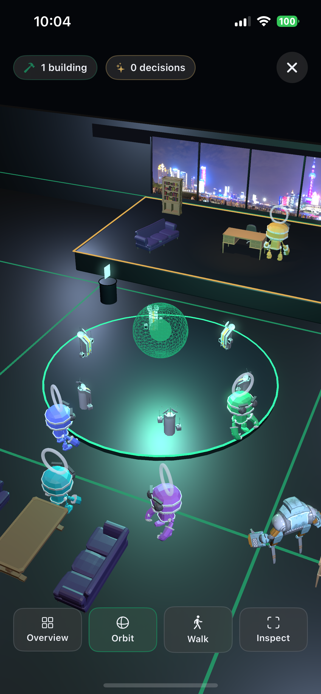
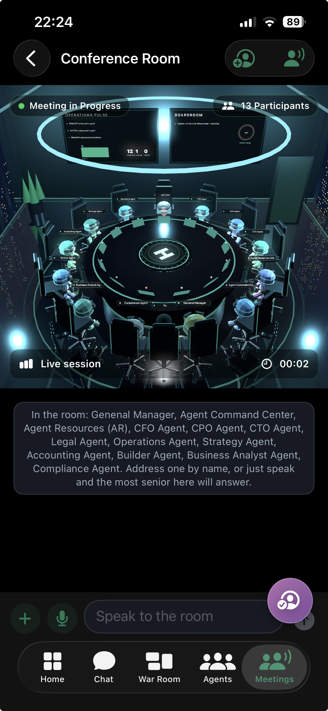
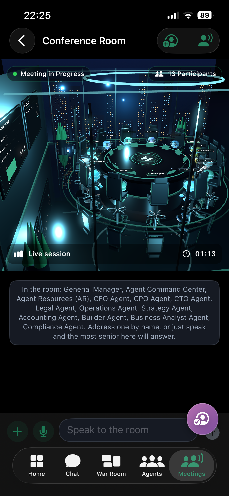
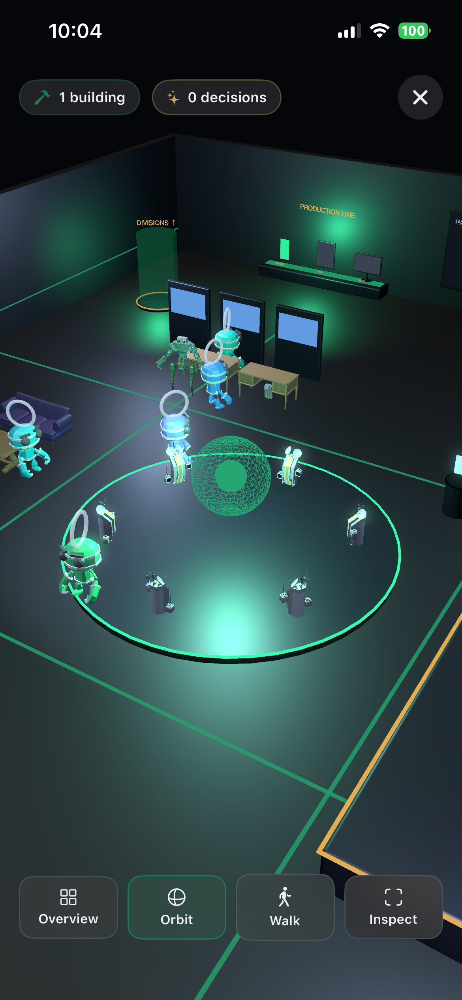
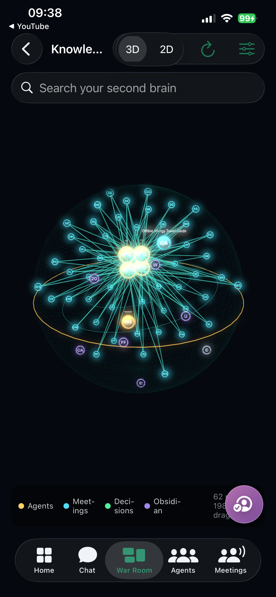
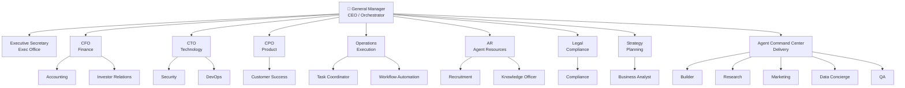
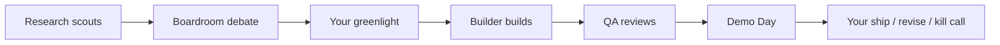
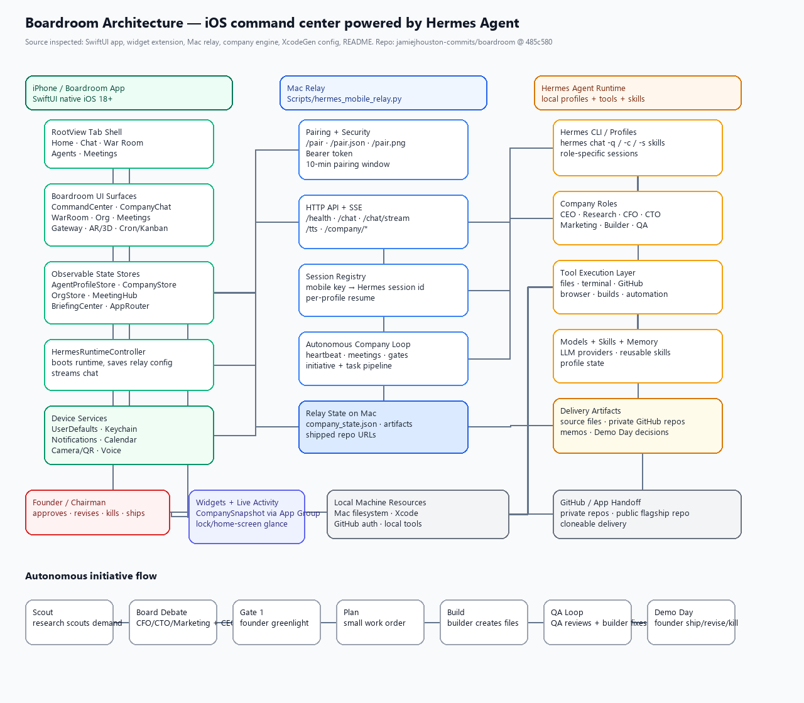
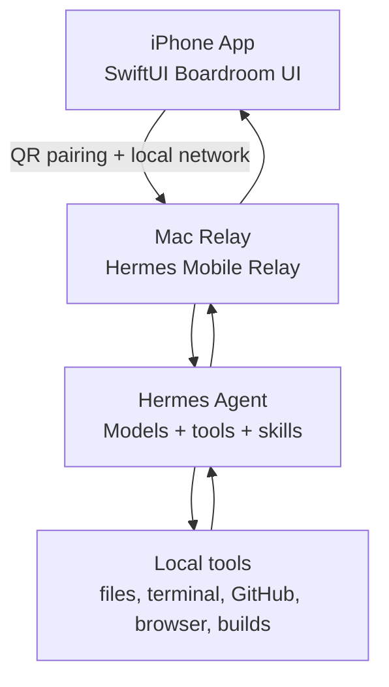

# Boardroom

**Don’t use an AI. Employ one.**

Boardroom is an iPhone command center that turns Hermes into an autonomous AI company. You do not just chat with one assistant — you run a whole organization: CEO/General Manager, CFO, CTO, CPO, Operations, Legal, Strategy, Resources, builders, researchers, marketers, data agents, and QA.

You can walk around the company, enter agent offices, talk to specialists, join boardroom debates, approve initiatives, watch the team build, review Demo Day, and keep the whole operation under your control from your phone.

> Boardroom is not another thin AI wrapper. It is an operating layer for autonomous agents: org structure, meetings, memos, voice calls, office navigation, build pipelines, QA loops, and founder approval gates.

## See it

Real captures from the iPhone app — the whole company rendered in 3D, live.

<table>
  <tr>
    <td align="center" width="33%"><br><sub><b>Headquarters</b> — walk the floor, one office up</sub></td>
    <td align="center" width="33%"><br><sub><b>Boardroom</b> — the whole team at the table</sub></td>
    <td align="center" width="33%"><br><sub><b>Live meeting</b> — orbit the room mid-debate</sub></td>
  </tr>
  <tr>
    <td align="center" width="33%"><br><sub><b>Divisions floor</b> — production line & agents at work</sub></td>
    <td align="center" width="33%"><br><sub><b>Second brain</b> — the company's knowledge in 3D</sub></td>
    <td width="33%"></td>
  </tr>
</table>

## Why it matters

Most “AI agent” apps are just chat boxes with a nicer prompt. Boardroom is different:

- **It gives your agent a company structure**, not just a text window.
- **It separates roles**, so finance, product, engineering, research, legal, marketing, and QA can reason differently.
- **It makes the user the Chairman**, not the babysitter.
- **It runs initiatives through a pipeline**, from market scouting to board debate to build to QA to Demo Day.
- **It keeps work local-first**, using your Mac, your Hermes setup, your models, your tools, and your data.

## The autonomous company model



In plain terms:

- **Top:** General Manager / CEO orchestrates the company.
- **Department heads:** CFO, CTO, CPO, Operations, AR, Legal, Strategy, Agent Command Center, and Executive Secretary.
- **Specialists:** Accounting, Investor Relations, Security, DevOps, Customer Success, Task Coordination, Workflow Automation, Recruitment, Knowledge Officer, Compliance, Business Analyst, Builder, Research, Marketing, Data Concierge, and QA.

When the company runs an initiative, the flow is:



## What you can actually do

### 🏢 Walk around the company

Boardroom gives the agents a place. You can move through the company floor, enter offices, open the command center, inspect departments, and interact with the people running your AI company.

### 👤 Talk to agents in their own offices

Each agent has a role, identity, voice/personality, profile, and workspace. You can chat with a specific agent instead of dumping everything into one generic assistant.

### 📞 Voice-call your agents

Hold a conversation with an agent like a call. Ask the CEO for a status update, ask the CTO what is blocked, ask the CFO if an idea makes commercial sense, or ask QA what failed.

### 🏛 Run boardroom debates

The company can debate ideas out loud: CEO, CFO, CTO, CPO, Strategy, Legal, and others weigh in from their own perspective. Dissent is not hidden. Minutes are captured.

### 🚦 Keep founder approval gates

The agents do not blindly run away. Boardroom is designed around founder control:

1. The company scouts and debates.
2. You approve, reject, or revise.
3. The team builds.
4. QA reviews.
5. You make the final Demo Day call.

### 📝 Memos, meetings, and briefings

Boardroom includes meeting scheduling, prep memos, attendee routing, briefing views, and company memory surfaces so work does not disappear into chat history.

### 🛠 Build with your Mac

Boardroom connects the phone to a Mac relay running Hermes. The Mac does the real work: tools, files, code, shell, builds, testing, and automation. The phone becomes the control room.

### 🔐 Local-first by design

No random cloud agent account is required. Your iPhone talks to your Mac. Your Mac runs Hermes. Your tools and data stay under your control.

## Feature highlights

- iPhone command center for Hermes Agent
- Corporate org chart with departments and specialists
- Agent offices and company floor navigation
- Individual agent chat
- Voice calls with agents
- Boardroom debate mode
- Founder approval gates
- Initiative pipeline: scout → debate → greenlight → build → QA → Demo Day
- Meeting room and attendee flows
- Memos and briefings
- Runtime/gateway pairing
- Mac relay for real tool execution
- Live autonomous company state
- Local-first architecture
- SwiftUI native iOS interface

## Architecture

For the editable system architecture diagram, see [`docs/architecture/`](docs/architecture/).





Everything runs through hardware you control:

- **iPhone:** command center, offices, meetings, debates, approvals.
- **Mac relay:** bridge between phone and Hermes.
- **Hermes Agent:** autonomous reasoning and tool execution.
- **Local tools:** code, files, shell, GitHub, build systems, automations.

## Requirements

- iPhone running iOS 18+
- Mac on the same Wi‑Fi
- [Hermes Agent](https://hermes-agent.nousresearch.com) installed and configured on the Mac
- Xcode for local build/install
- XcodeGen if regenerating the project

## Quick start

```bash
git clone https://github.com/jamiejhouston-commits/boardroom.git
cd boardroom
./Scripts/setup.sh
```

Then build the app onto your iPhone:

```bash
xcodegen generate
open HermesMobile.xcodeproj
```

In Xcode:

1. Select the app target.
2. Open **Signing & Capabilities**.
3. Choose your Apple Developer team.
4. Run on your iPhone.
5. Open **Gateway → Scan Pairing Code**.
6. Pair with the Mac relay.
7. Enter the Boardroom.

## Current status

Boardroom is early but real. The core product exists today: company floor, agents, chat, voice, meetings, debates, memos, runtime pairing, and the autonomous company pipeline.

It is still being actively improved. Expect rough edges, but this is already much more than a mockup or prompt wrapper.

## License

[PolyForm Noncommercial 1.0.0](LICENSE.md) — free for personal and noncommercial use; commercial use requires a license.

Boardroom is an independent project. It is not affiliated with Nous Research.
